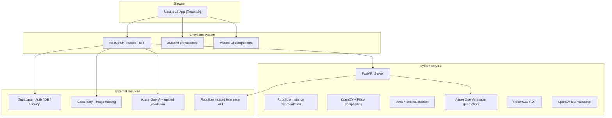

# RenovateAI — Backend (FastAPI)

AI-powered exterior house renovation API. Handles **Roboflow** instance segmentation, material compositing (OpenCV + Pillow), area and cost estimation, Azure OpenAI photorealistic redesign, blur validation, and PDF report generation.

This folder is the **FastAPI service**. The Next.js frontend lives in the sibling directory [`../renovation-system/`](../renovation-system/). See the [root README](../README.md) for the full monorepo overview.

## Architecture



## Tech Stack

| Layer | Technology |
|-------|-----------|
| API | FastAPI, Uvicorn, Pydantic v2 |
| HTTP client | httpx (shared async client, lifespan-managed) |
| Segmentation | **Roboflow** hosted API (`services/sam_service.py`) |
| Images | Pillow, OpenCV (`opencv-python-headless`) |
| Visualization | Polygon masks + texture compositing (`visualization_service.py`) |
| Area | Shoelace formula on normalized polygons (`area_service.py`) |
| Costs | Quantity × rates + wastage (`cost_service.py`) |
| AI redesign | Azure OpenAI image deployment (`ai_polish_service.py`) |
| Validation | Laplacian blur detection (`validation_service.py`) |
| Reports | ReportLab PDF (`report_service.py`) |
| Auth | `x-service-secret` middleware (`core/middleware.py`) |
| Frontend | Next.js in [`../renovation-system/`](../renovation-system/) |

> **Note:** We do **not** run SAM/SAM2 locally. Segmentation uses a custom Roboflow instance-segmentation model (`house-parts/1` or your own `ROBOFLOW_MODEL_ID`). See [Why Roboflow?](#why-roboflow-not-sam) below.

## Endpoints & Workflow

The Next.js BFF calls these routes during the 6-step wizard:

| Step | Python route | Purpose |
|------|----------------|---------|
| 1 Upload | `POST /validate/blur` | Laplacian variance blur check |
| 2 Detect | `POST /segment` | Roboflow polygons (or mock regions) |
| 4 Visualize | `POST /visualize` | Material texture overlay (base64 JPEG) |
| 4 AI polish | `POST /ai-design` | Overlay + Azure photorealistic pass |
| 5 Estimate | `POST /estimate` | Area, quantity, and INR cost breakdown |
| 6 Report | `POST /report` | PDF stream (`application/pdf`) |

Public (no secret): `GET /health`, `/docs`, `/openapi.json`, `/redoc`.

## Local Development

### Prerequisites

- Python 3.10+
- Node.js 18+ (for `renovation-system` when testing end-to-end)
- Roboflow API key + model ID (optional — mock regions if missing)
- Azure OpenAI (optional — required for `/ai-design` polish)

### 1. Create virtual environment and install dependencies

```bash
cd python-service
python -m venv venv
venv\Scripts\activate          # Windows
# source venv/bin/activate     # macOS/Linux
pip install -r requirements.txt
```

### 2. Environment variables (`.env`)

Create `python-service/.env`:

| Variable | Description |
|----------|-------------|
| `SERVICE_SECRET` | Shared secret; must match `PYTHON_SERVICE_SECRET` on the frontend |
| `ROBOFLOW_API_KEY` | Roboflow API key (Settings → API Key) |
| `ROBOFLOW_MODEL_ID` | Model id as `project-name/version` (e.g. `house-parts/1`) |
| `AZURE_OPENAI_ENDPOINT` | Azure OpenAI resource endpoint |
| `AZURE_OPENAI_API_KEY` | Azure API key |
| `AZURE_OPENAI_DEPLOYMENT` | Chat deployment (used by frontend for building validation) |
| `AZURE_OPENAI_IMAGE_DEPLOYMENT` | Image generation deployment (e.g. `gpt-image-2`) for `/ai-design` |
| `REPLICATE_API_TOKEN` | Reserved in config; not used by current routes |

Frontend variables (`NEXT_PUBLIC_SUPABASE_*`, `CLOUDINARY_*`, `PYTHON_SERVICE_URL`, etc.) go in [`../renovation-system/.env.local`](../renovation-system/.env.local).

### 3. Roboflow segmentation

1. Sign up at [roboflow.com](https://roboflow.com)
2. Use a Universe model (building/house exterior) or train your own instance-segmentation model
3. Set `ROBOFLOW_API_KEY` and `ROBOFLOW_MODEL_ID` in `.env`
4. Without these keys, `POST /segment` returns **mock regions** (5 predefined polygons) for local development

### 4. Start the server

```bash
uvicorn main:app --reload --port 8000
```

- API docs: [http://localhost:8000/docs](http://localhost:8000/docs)
- Health: [http://localhost:8000/health](http://localhost:8000/health)

### 5. Start the frontend (optional, full stack)

```bash
cd ../renovation-system
npm install
# Set PYTHON_SERVICE_URL=http://localhost:8000 and PYTHON_SERVICE_SECRET=<same as SERVICE_SECRET>
npm run dev
```

Open [http://localhost:3000](http://localhost:3000).

## Project Structure

```
E2M task/                          # Monorepo root
├── renovation-system/             # Next.js frontend (sibling)
│   └── app/api/                   # BFF routes → this service
│
└── python-service/                # ← You are here (FastAPI backend)
    ├── main.py                    # App factory, lifespan, /health
    ├── core/
    │   ├── config.py              # Settings from .env
    │   └── middleware.py          # CORS + x-service-secret
    ├── routers/
    │   ├── segment.py             # POST /segment
    │   ├── visualize.py           # POST /visualize
    │   ├── estimate.py            # POST /estimate
    │   ├── report.py              # POST /report
    │   ├── validate.py            # POST /validate/blur
    │   └── ai_design.py           # POST /ai-design
    ├── services/
    │   ├── sam_service.py         # Roboflow client (historical filename)
    │   ├── visualization_service.py
    │   ├── area_service.py
    │   ├── cost_service.py
    │   ├── ai_polish_service.py
    │   ├── report_service.py
    │   ├── validation_service.py
    │   ├── image_utils.py
    │   └── http_client.py
    ├── schemas/                   # Pydantic request/response models
    ├── requirements.txt
    └── vercel.json                # @vercel/python deployment
```

## HTTP API Reference

All protected routes require header:

```
x-service-secret: <SERVICE_SECRET>
```

| Method | Path | Request body (summary) | Response |
|--------|------|------------------------|----------|
| `GET` | `/health` | — | `{ roboflow_configured, model_id, version }` |
| `POST` | `/validate/blur` | `{ image_url }` | `{ is_blurry, score, threshold }` |
| `POST` | `/segment` | `{ image_url, project_id }` | `{ segments: [...] }` |
| `POST` | `/visualize` | image + segments + materials | `{ redesigned_image_base64 }` |
| `POST` | `/ai-design` | same as visualize | `{ overlay_image_base64, ai_polished_image_base64 }` |
| `POST` | `/estimate` | segments, assignments, materials, optional rates/wastage/pixels_per_foot | `{ area_data, quantity_data, cost_data }` |
| `POST` | `/report` | project title, images, `cost_data`, … | PDF file stream |

### Segment output shape

Each segment includes:

- `label` — region name (e.g. `main_wall`, `window_left`)
- `mask_polygon` — `[[x, y], ...]` normalized 0–1
- `bbox` — `[x1, y1, x2, y2]` normalized
- `confidence` — model score

## How Estimation Works

### 1. Surface area

After Roboflow (or mock) segmentation, each region has a normalized polygon (`mask_polygon`).

- **Shoelace formula** — pixel area from vertices (`area_service.py`)
- **pixels_per_foot** — default `10`; overridable per request from the frontend
- Image dimensions are read from the hosted `image_url` (Cloudinary)

### 2. Material quantity

```
quantity = area_sqft / coverage_per_unit
```

Coverage comes from the `materials` payload (loaded from Supabase on the frontend).

### 3. Cost per region

```
material_cost = quantity × material_rate_per_unit
labor_cost    = quantity × labor_rate_per_unit
total         = material_cost + labor_cost
```

Optional `rate_overrides` per material id. Currency: **INR**.

### 4. Wastage

```
grand_total = subtotal + subtotal × (wastage_percent / 100)
```

Default wastage: **12%** (overridable in request).

## Why Roboflow (Not SAM)

We evaluated **SAM2** for zero-shot masks but ruled it out for this stack:

- Needs GPU (~8 GB VRAM) for practical latency
- ~2.5 GB weights exceed typical serverless limits
- CPU inference is too slow for an interactive wizard

**Roboflow hosted inference** fits our deployment model:

- REST API — no GPU to host
- Custom `house-parts` instance-segmentation model with polygon outputs
- Free tier for development; mock fallback when keys are absent

Implementation: [`services/sam_service.py`](services/sam_service.py) (calls `https://detect.roboflow.com/{model_id}`).

## Deployment

### Vercel

`vercel.json` routes all paths to `main.py` via `@vercel/python` (50 MB lambda limit).

1. Deploy the `python-service/` directory as its own Vercel project
2. Set the same env vars as local `.env`
3. Point `PYTHON_SERVICE_URL` on the frontend to the deployed URL

### Railway / Docker / VM

```bash
uvicorn main:app --host 0.0.0.0 --port 8000
```

Use the same environment variables. Ensure `SERVICE_SECRET` matches the Next.js `PYTHON_SERVICE_SECRET`.

## Known Limitations

- **Area accuracy** — Pixel-to-sqft is approximate; no perspective correction in the Python layer
- **Roboflow quota** — Free tier ~1,000 inferences/month; API latency ~1–3 s
- **Fixed region classes** — Depends on your Roboflow model’s label set
- **AI redesign** — Azure image generation may alter fine architectural detail; returns `null` for polish if Azure is not configured
- **Blur check only** — Building/exterior validation runs in the Next.js layer (Azure), not in this service
- **Serverless size** — Heavy deps (OpenCV, ReportLab) target small images; very large uploads may be slow on cold starts

## License

Developed as part of the E2M task assignment.
